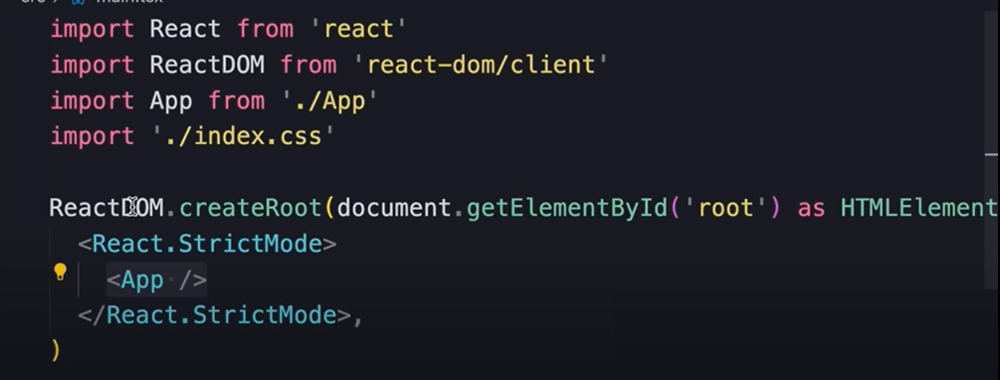
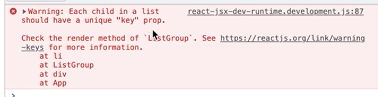

# Getting Started with React
> Adapted from [Mosh Hamedani's Youtube Channel](https://youtu.be/SqcY0GlETPk?si=rJv02qXNLsogQeD6)
## Setting up the development Environment
### Check Version of NodeJs in your machine:
`node -v`

### If you dont have Node
You can install by `sudo apt install nodejs` or head up to [](nodejs.org)


### Highly suggested that you use VScode
Advised to use the prettier extension for code refactoring
**setup Prettier** Go to `Preference` > `settings` > `Format on save`
### ES7 + React / Redux / React-Native sn
- This extension gives you more intellisence including use of the `rafce` templating at component creation
- Just type ES7+ in extension search and install


## Creating a react app
### 1. Using Vite (*much faster & gives us smaller bundle sizes*)
`npm create vite@latest` or specify version `npm create vite@4.1.0`
Specificy framework react, language (typescript), then `cd "project name"`, `npm i` to install all third party libraries, `code .` to open the folder, `npm run dev` to run our webserver <br>
under the hood, Vite managed the changes in real time via `hmr`


### 2. Using Create React APP (CRA) *tool by the official react team, but painful to setup with alot of third-party apps*

### 3. Meta Frameworks *(NEXT.js)*


### 4. Simply use [stackblitz](https://stackblitz.io) and cut all the bs


## Project structure (*with vite*)
>**REACT-APP (folder)**
>>**Node Modules**: Where third party libraries and other tools are installed (less likely you ever have to touch it) <br>
>>**Public**: All public assets of the app resides here <br>
>>**src**: Source code of our app
>>>***main.tsx**: It uses ReactDOM to render the component tree inside an element with id of `root`
>>>***App***: The app component 
>>***index.html:*** Contains a div with id `root`, a container for our application. <br>
>>***package.json:*** Information about this project (name, version, scripts, list of dependencies)<br>
>>***tsconfig.json:*** Telling the ts compiler on how to compile our TS into JS (less likely you gonna ever need to touch it)<br>


## How React Works
Currently the `root` is **App** and the **Message** being the child
When react starts it takes the componet tree and build a JS data structure - The **VirtualDOM** <br>
**VirtualDOM:** Is the lightweight in-memory representation of the component tree, where each **node** represents a component and its properties <br>
When a componet changes react updates the corresponding **Node** in the component tree to reflect the new state 
The DOM is updated by the **ReactDOM** compiling library
Inside **main.tsx** we use ReactDOM to render this component tree, inside an element with an id of `root`

### React is platform-agnostic
This means it can use to build UIs that are not tied to a specific platform, this is because:
- **Separation of logic and Rendering:** React strictly focues of the structure of the UI while the rendering is handles by different libraries
- **Multiple renderes (libraries):** **ReactDOM**  for web apps, **React Native** for iOS and Android, etc
- **Platfrom-specif APIs:** Allow use of platform-specific APIs while core logic can be shared

## Creating a react component
In **src** file add  a file with "componetName".tsx naming

### 1. With a JavaScript class *(older projects)*
### 2. With a function *(more popular since they are concise and easy to understand)*
``` 
function Message(){
    return <h1>Hellow word</h1>
} 
export default Message 
// To use a component, we first to export it as a default object for this module
```
The above sysntax is JSX: (JavaScript XML), Visting [babeljs.io](https://babeljs.io/repl) to see how JSX to JS converstion is done

Below is a sample usage of the exported component
```
import Message from './Message';

function App(){
    return <div></Message></div>
}

export default App

```
JSX allow us to easilt create dymanic content; Within `{}` we can write any pieace of code that return a value, whether a variable or a function e.g `<h1> Hi {getName()} </h1>` or `<h1> hi {name}</h1>`
```
function Message(){
    const name = 'ignasxv';
    return <h1>Hello {name} </h1>
}
```

## Creating a ListGroup Component
### Installing bootstrap
- `npm i bootstrap@5.2.3` or any other version
- You can get rid of ***App.css** and **index.css**
- In Main.tsx, replace `./index.css` with `bootstrap/dist/css/bootstrap.css`
- Done: You should now notice app changes in teh browser

### In `src` folder add a `components` folder
- with component create `ListGroup.tsx` - component
-  Create your List group as a fx and export it
- Copy paste the correposing class from bootstrap 
- remember to change `class` to `className` since `class` is a reserved keyword
- If you are returning multiple elements wrap them in fragments `<> </>` (wrap with abv)

### Rendering Lists dynamically
- declare a list `const items = ['a', 'b'];
- Can't use a for loop; so we use `map` function 
- so: `items.map(item => <li>{item}</li>)`, remember to wrap in `{}`
- 
- To give each child unique key: `items.map(item => <li key={item}>{item}</li>)`, remember to wrap in `{}`

### Conditional Rendering
- ` {condition ? <p>Condition True</p> : null}` 

### Event handling
- **State vs Props:** 

    - Props: Inputs passed ot a component
        - Treat them as Immutable: 
        - 

    - State: Data Managed by a component
        - They are mutable

- can use the `onClick{ () => {}}` function
- we can also declare a function to handle our event
    - `const handleEvent = (e: MouseEvent) => console.log(e.)`
    - Since we are using TS we will have to import the specific event to have type annotation

     ```tsx
        import React from 'react';
        import { MouseEvent } from 'react';

        function handleClick(event: MouseEvent<HTMLButtonElement>) {
        console.log('Button clicked:', event);
        // You can now access MouseEvent properties with proper type checking
        console.log('Mouse button:', event.button);
        console.log('Mouse coordinates:', event.clientX, event.clientY);
        }

        const MyComponent: React.FC = () => {
        return <button onClick={handleClick}>Click me</button>;
        };

        export default MyComponent;
    ```
    - Once type annotation is perfomed, we get more intellisense through the dot operator
    
    ```tsx
    import { MouseEvent } from "react";

    function ListGroup() {
    const items = ["kenya", "uganda", "kampala"];
    const name = "ignas";

    const handleClick = (e: MouseEvent) => {
        console.log("clicket");
        console.log(e.clientX, e.clientY);
    };

    function handle2(e: MouseEvent) {
        console.log(e.currentTarget);
    }

    return (
        <>
        <h1>Items</h1>
        {items.length === 0 && <p>Note enough items</p>}
        <ul className="list-group">
            {items.map((item, index) => (
            <li key={item} className="list-group-item" onClick={handleClick}>
                {item}
            </li>
            ))}
        </ul>
        </>
    );
    }

    export default ListGroup;

    ```   
#### Hooks / State Management
- when we want to track changed through a variable, we should use a state variable which can be detected by react globally
    - To achieve this, we use a hook (`useState()`)
    - `useState()` returns an array where arr[0] is the variable and arr[1] is the updater of the variable
    ```ts
    const arr = useState(-1);
    arr[0] //variable
    arr[1] // updater
    ```
    - Usage
        ```ts
        if (arr[0] == 2 ) arr[1](arr(0) + 1);
        ```
    - alternatively we can destructure the array:
    ```ts
    //the useState() takes initial value of the variable as a constant, in this case -1
    const [variable, updater] = useState(-1);
    ```
    - Usage
        ```ts
        if( variable = 2) updater(variable + 1);
        ```

### Props Data Passing
- Instead of defining items within the component, whould pass them ass props
- For our listGroup we need A list and string
    - we than pass an object with te given properties
    - To achieve this we use an `interface`
        ```ts
        interface PropsName(){
            items: string[];
            heading: string;
        }
        ```
    - to use the props values we can just call `props.propertyName`
        
    - we then give our function a parameter props with type `PropsName` 
        ```ts
        function ListGroup(props: PropsName){

        }
        ```
    - Now whenever we use the ListGroup component, we will have to pass the props values
        ```ts
        function App() {
            const items = ["kenya", "uganda", "kampala"];

            return (
            <>

            <ListGroup items={items} heading="Cities"/>

            </>
            )
        }
        ```
        
        - or we can destructure is to directy get the values 
        ```ts
        function ListGroup({items, heading}: PropsName){

        }
        ```
- You can create default vales for props by predefining them in the function headers
    - And making the property optional by adding `?`
- Passing functions as Props
    - The following structure how you can add a function as a prop
    ```ts
        
        interface PropsName{
            // this is the signature of our function
            onSelectItem: (item: string) => void;
        }
    ```
     - This function takes parameter item of type string and doesn't return anything

        ```ts
        <ListGroup onSelectItem = {(item: string) => {console.log(item)}} items={items} heading="Cities"/>

        ```
        - Withing the actual component we dynamically evoke the function as follows:
            ```ts
            onClick={() => {
              onSelectItem(item);
            }}>
  
            ```
### Passing data to Childre (Props Propagation)
#### Passing HTLM contents
- rename the prop name to type `ReactNode` and name to *children* (this will prevent react from demanding this prop to be passed as attributes)

### Dealing with invalid Prop inputs
- Example if `reddish` was to be passed as button color, out button will end up with no sytling
    - For this we can use a union operator to give a rnage of optois for the color
        ```ts
          color?: 'primary' | 'danger' | 'warning';


# React Notes fron [react.dev](react.dev/learn)

## Creating and nesting componets
- React apps are made out components
    - **A Component** is a piece of UI that has its own logic and appearence
    - React components are basically JS functions that return markup
        ```tsx
        export default function MyComponent(){
            return (
                <h1>This is a Component</h1>
                <AnotherComponent/>
            );
        }

        function AnotherComponent(){
            return (
                <h2>Another component</h2>
            );
        }
        ```
    - *As a convention Componets must always start with a Capital letter, while HTML tags tags must be lowercase*
    - `expor default` keyword specifies the main component in the file
    - JSX markup is used for convenience 
    - specify css class with `className`
## Conditional rendering

## Responding to events
- You can respond to events by declaring `event handler` functions inside your components
## Hooks
- Functions starting with `use` are called *hooKs*
- Built-in React Hooks
    - State Hooks: lets a componets rememver info like user input
        - `useState()`: declares a state varible that you can update directly
        - `useReducer()`: Allows easier state management in a component with growing complexity, it allows props to be managed in a central reducer function
